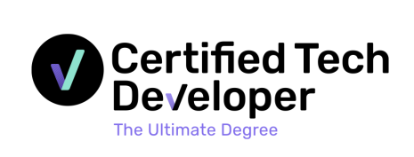

# Bautista Onorato

**`IT Support & Help Desk | CompTIA A+ | Microsoft 365 & Azure`**

---

IT technician focused on technical support and help desk roles, with hands-on experience in Active Directory, Microsoft 365, Intune, and Hyper-V virtualization. CompTIA A+ certified, with a demonstrated ability to troubleshoot, document processes, and work across Windows, Linux, and macOS environments.

---

## 🔧 Skills

| Area | Technologies |
|------|-------------|
| **Support & OS** | Windows 10/11, Windows Server 2025, macOS, Debian Linux |
| **Identity & Directory** | Active Directory, Microsoft Entra ID, Entra Connect, GPO |
| **Cloud & Microsoft 365** | Exchange Online, Intune, SharePoint, Purview, Azure Backup |
| **Virtualization** | Hyper-V, VMWare, VirtualBox, Docker |
| **Networking** | DHCP, DNS, VPN (WireGuard), TCP/IP |
| **Security** | MFA, Conditional Access, BitLocker |
| **Monitoring** | Zabbix, Grafana |
| **Scripting** | PowerShell, Bash, Python |
| **Tools** | Git, Jira, Notion, Action1 |
| **Programming** | Python, Go, Java, JavaScript, TypeScript, SQL, React, Next.js |

---

## 🏗 Featured Project — Hybrid Active Directory Home Lab

> A fully documented enterprise-grade lab built from scratch on a single Windows 10 Home machine, covering on-premises infrastructure, hybrid cloud integration, endpoint management, and monitoring.

| Phase | Scope |
|-------|-------|
| **Phase 1** – Core Infrastructure | Hyper-V, Windows Server 2025, AD DS, DNS, Windows 11 workstations |
| **Phase 2** – Identity & Policy | OU design, DHCP, GPOs (BitLocker, NTLMv2, LDAP/SMB signing, USB control), file shares |
| **Phase 3** – Hybrid Cloud | Entra ID, Entra Connect (PHS + SSO), MFA, Conditional Access, Intune, Exchange Online, Azure Backup |
| **Phase 4** – Monitoring | Zabbix 7.0, Grafana, email alerts via Microsoft Graph API (OAuth 2.0) |
| **Extras** | WireGuard VPN gateway, Action1 patch management |

📂 **[View the full lab documentation →](https://github.com/BautistaOnorato/Hybrid-Active-Directory-Home-Lab)**

---

## 💻 Development Projects

> Projects built during my software development training. This is a secondary area — my main focus is IT support — but these reflect my ability to work with modern stacks and ship complete products.

| Project | Description | Stack |
|---------|-------------|-------|
| **[Thinki](https://github.com/BautistaOnorato/thinki-ai)** | Platform to create and customize AI agents for interaction via video calls and chat. Features authentication (BetterAuth), real-time communication (Stream.io), and subscription management (Polar). | Next.js · TypeScript · TailwindCSS · OpenAI · Drizzle ORM · Neon · Inngest · Polar |
| **[Hay algo ahí](https://github.com/BautistaOnorato/HAA)** | Informational website for the first season of an Argentine streaming show. Built with Astro for fast static content and React for interactive components. | Astro · React · TypeScript · CSS · Figma |
| **DiceLogger - [Frontend](https://github.com/BautistaOnorato/DiceloggerFront) / [Backend](https://github.com/BautistaOnorato/Dicelogger-back)** | Campaign and character management app for Dungeons & Dragons. Includes friend system, campaign sharing, and subscription-based exclusive content. | Next.js · Go · TypeScript · MySQL · AWS · Stripe · Figma |

---

### 📜 Certifications

<a href="https://drive.google.com/file/d/1BMDNG2ZFLnqC53GdIKXrsWf_rYayn8hk/view">
   
  <strong>CompTIA A+</strong> 
  View Certificate →
</a>

  

 
<strong>Cambridge First B2</strong> 

  

<a href="certifications/certified-tech-developer.png">
   
  <strong>Digital House - Certified Tech Developer</strong> 
  View Certificate →
</a>

---

### 📄 Resume / CV

